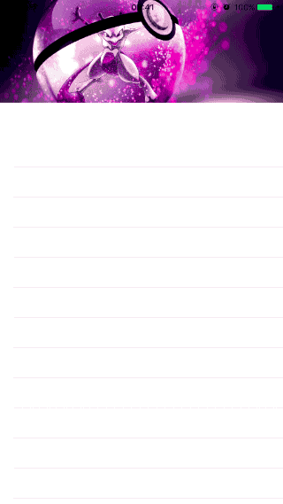

# MSHeaderScaleImage
简单集成 UITableView HeaderView 缩放图片效果

**此项目参考了 [袁峥Seemygo](https://github.com/iThinkerYZ) 大牛的 [YZHeaderScaleImage](https://github.com/iThinkerYZ/YZHeaderScaleImage)。原理和源码都很简单，欢迎下载查看。**

## 演示



## 系统要求

* `iOS7` 及以上。
* Automatic Reference Counting(ARC)

## 安装

#### CocoaPods
1. 在 Podfile 中添加 `pod 'MSHeaderScaleImage'`。
2. 执行 `pod install` 或 `pod update`。
3. 导入头文件：`#import <MSHeaderScaleImage.h>`。

#### 手动安装
1. 下载 MSHeaderScaleImage 项目。
2. 将 `MSHeaderScaleImage` 文件夹中的源文件拽入项目中。
3. 导入头文件：`#import "MSHeaderScaleImage.h"`。

## 使用

使用非常简单，**把 tableView 的 headerView 的背景颜色设置为透明色，然后设置图片和显示图片区域的默认高度就可以了。**比如demo里的源码：

```object-c
// 把背景设置为透明，不然会挡住缩放图片
headerView.backgroundColor = [UIColor clearColor];
tableView.tableHeaderView = headerView;
// 设置缩放图片
tableView.ms_headerScaleImage = [UIImage imageNamed:@"headerImage.jpg"];
// 设置默认高度
tableView.ms_defaultDisplayRectHeight = 150;
```

## 许可证

MSHeaderScaleImage 使用 MIT 许可证，详情见 LICENSE 文件。

***

## 原理
把 UIImageView 作为 UITableView 的子视图插入到其子图层底部，然后监听 UITableView 的 contentOffset.y 的变化来对 UIImageView 作缩放。

## 技术点
* 利用 Objective-C 语言的类别和运行时特性给 UITableVeiw 类扩展了设置图片和默认高度的属性。
* 使用懒加载的方式创建 UIImageView。
* 使用 KVO 技术监听 UITableView 的 contentOffset 的变化。

## 细节
1. 此项目创建的是 UITableView 的类别，是因为考虑到用到这种效果的一般都是用在 UITableVeiw 的 tableHeaderView 中。

2. 项目中并没有在 +(void)load 方法里 hook （交换）任何的方法，只会在使用的时候才会执行源码，完全没有侵入性（相比，如果 hook 了 UITableView 的 setTableHeaderView: 方法，只有设置了 tableHeaderView，不管需不需要缩放图片效果，都会执行源码）。

3. 为什么把 UIImageView 作为 tableView 的子视图而不是 tableHeaderView 的子视图？两种方式的效果都是一样的，如果是作为 tableHeaderView 的子视图的话就需要 hook setTableHeaderView: 方法，这样不太好。

4. UIImageView 的宽度固定为屏幕宽度，因为实在是没有看到过其他宽度的效果的案例。而且这样固定宽度后，代码就变得简单多了，最重要的一点是不用考虑是不是 autolayout 的布局方式了。

5. 为什么不把高度默认为 tableHeaderView 的高度？因为这样需要 hook setTableHeaderView: 方法。而且很多情况都是需要用户来自定义的，所以就没有给默认高度。

## 感受
在做项目的过程中，刚开始考虑到的情况太多了，把一些不常见的情况也都考虑进去了，这样会使代码变得更加复杂。比如，把宽度考虑为适应 tableHeaderView 或者 提供为接口来自定义，这样就需要 hook setTableHeaderView: 方法 或者提供一个属性来让用户设置。如果考虑为适应 tableView 的宽度的情况的话还要考虑布局方式的问题等等。但是大部分情况宽度都是屏幕的宽度，所以增加代码的复杂度而获得的收益并不是很明显。这就是接口设计时经常要考虑的取舍问题。所以我最大的收获就是在做一些通用的工具的时候，主要考虑大部分情况，其他少数情况可以适当的不作考虑。至于怎么才算适当，我会把代码的复杂度带来的收益考虑进去。

## YZHeaderScaleImage 项目的一些问题
* YZHeaderScaleImage 创建的是 UIScrollView 的类别，但是运行时交换的是 UITableView 的 setTableHeaderView: 方法，所以设置 UITableView 的 tableHeaderView 的时候，并不会调用自定义的方法。
